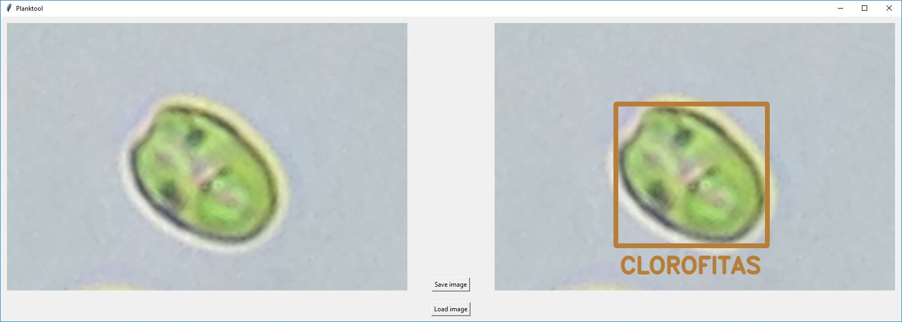
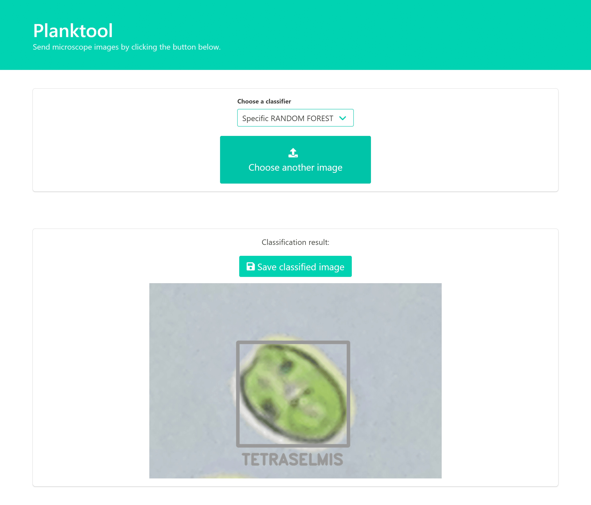

# Planktool 

[](paper.pdf)

Planktool is an automatic plankton image classification software. Simply put, you feed it an image and it draws a rectangle on identified plankton, with its corresponding class.

The following commands are avaiable:

```bash
$ python planktool.py gui
$ python planktool.py web

$ python planktool.py build-dataset
$ python planktool.py build-models
$ python planktool.py build
```

## Interfaces

This repository has both web and graphical user interfaces, available through:

```bash
$ python planktool.py gui
$ python planktool.py web
```

The main difference is that the web interface can choose between different classifiers, while the GUI uses a Random Forest with Generic classes.

### GUI

 


### Web interface



## Training classifiers

For convenience, some trained models are already provided with Planktool. However, to best suit your applications, you may wish to train classifiers yourself.

The `input_images` directory is used to train different classifiers. Planktool can extract features from your images and generated trained models for two different sets of classes derived from the directory structure:

- Generic classes are the root-level folders;
- Specific classes are the lowest-level folders.

For instance, suppose you have the following directory structure:

```
input_images
    |- A
    |  |- AA
    |  |  |- AAA (10 images)
    |  |  |- AAB (10 images)
    |  |
    |  |- AB (10 images)
    |
    |- B (10 images)

The generic classes would be composed by 30 As and 10 Bs, while specific would have 10 AAAs, 10 AABs, 10 ABs and 10 Bs.
```

You can then build the csv dataset using `$ python planktool.py build-dataset`, and build the classifiers with `$ python planktool.py build-models`. For convenience, as both commands are frequently used in sequence, you can just call:

```bash
$ python planktool.py build
```
