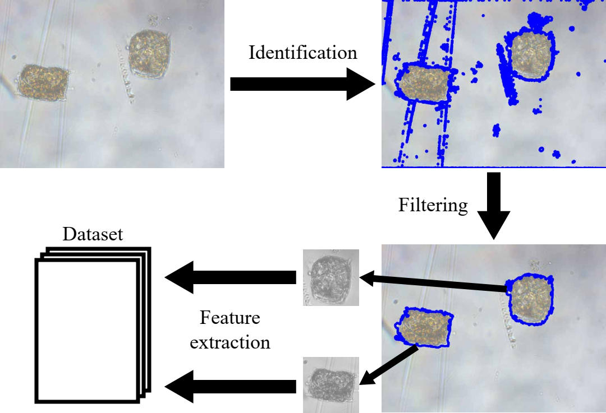

# Summary

Planktonic organisms have been identified as indicators of changes in coastal ecosystems due to their rapid growth, rapid response to environmental changes and their trophic and morphological plasticity.
An automatic system based on image analysis and classification of phytoplankton cells would be useful to monitoring the microplankton community in coastal systems.
The main purpose of this paper is to develop a plankton classification software.
This consists in identifying different types of phytoplankton based solely on image data. 
After acquiring an image set, we employ computer vision techniques to perform steps of object identification, filtering and feature extraction in order to obtain our final dataset.
The developed software is open-source and available under the MIT license.
To compare different classifiers in such classification problem, we considered a dataset collected in the coastal region of São Paulo. The trained classifiers are provided as part of the software.

# Statement of need

Due to their rapid growth, rapid response to environmental changes and their trophic and morphological plasticity, planktonic organisms have been identified as indicators of changes in coastal ecosystems, which in turn favor the growth of phytoplankton and the maintenance of high biomass of trophic levels [@mann2013dynamics]. Phytoplankton monitoring has been systematically based either individually or in combination on cell density, on chlorophyll biomass, occasionally including accessory photosynthetic pigments [@paerl2003microbial], and on analysis of variation in taxonomic composition [@abonyi2012phytoplankton]. The latter involves the use of microscopy methods, which require a high degree of technical training and high investment in analysis time. In this sense, the development of an automatic methodological system based on image analysis and classification of phytoplankton cells to improve a morphometric and functional database would be useful to assist in the establishment of a long-term monitoring program of the microplankton community in coastal systems.

The open-source tool we created is publicly available at https://github.com/mcf1110/planktool under MIT license. Its main purpose is to find and label plankton on a given image. The tool classifies the organism according to previously trained models. For convenience, we have already provided models that have been trained on the `Santos` dataset - which has been collected by one of the authors, consisting of samples from Santos on the coast of São Paulo -, but new models that best meet the needs of each application can be trained. The user can interact with the tool in two different ways: using a graphical interface (GUI) or with a web server. The next sections provide more details about the tool. 

# Training new models

The tool considers the following classifiers: Naïve Bayes, $k$NN, Decision Tree (CART), Logistic Regression, SVM and Random Forest. The parameters of the Random Forest and SVM were chosen by grid-search. Models that have been trained on the complete `Santos` dataset are provided with the tool to be used as desired.

However, each application is expected to have its own problem with different classes and therefore need different classifiers from ours. New models can be trained by selecting images whose labels are known and organizing them into directories according to those labels. Then, by executing a build command the software will identify plankton in the images and train different classifiers to replace the ones provided. The training process described \autoref{fig:fluxo}.

# Interacting with the tool

Once the models have been trained, using the software is simple. The main version is a web application, which starts a server that can receive and process images. A front-end interface is exposed to allow users to run classifiers over LAN or intranet, for example, without installing any additional end-user dependencies. Users can choose from all trained classifiers and see how their results differ.

The alternative way to use it is through the GUI. In this version, the classifier runs locally on each user's machine, and Python must be installed along with its dependencies. However, this version uses only one classifier, which our experiments show to be the most accurate.

# Acknowledgements

This study was financed in part by the Coordenação de Aperfeiçoamento de Pessoal de Nível Superior -- Brasil (CAPES) -- Finance Code 001.

# References
